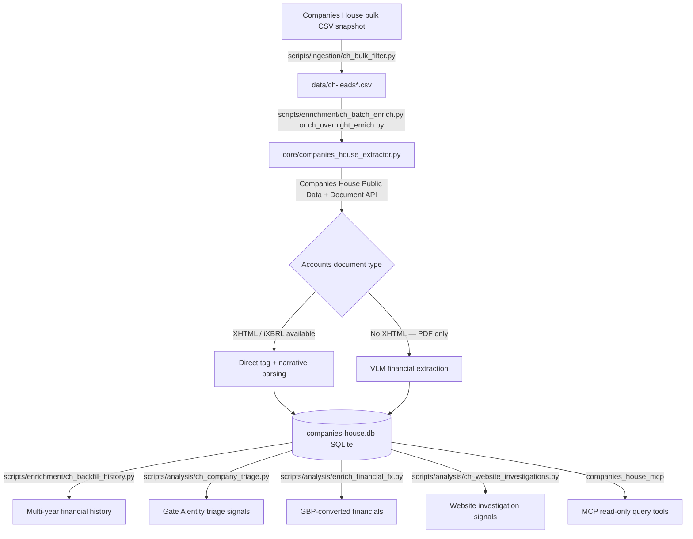
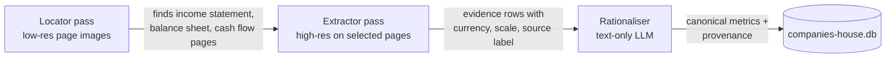

# Companies House Leads

Identifies and enriches UK Companies House leads for PPC (pay-per-click
advertising) prospecting. It filters the public Companies House bulk data
dump down to plausible advertisers, pulls each company's profile and
accounts (current and historical) through the official API, extracts
financial and narrative data from those accounts, and exposes the result to
MCP clients for querying and analysis.

## End-to-end system diagram



The default path is API-first: search or resolve a company, pull its
profile, filing history and latest accounts document, and parse the
XHTML/iXBRL tags directly. Companies House does not publish XHTML for every
filing — small/micro filers in particular are often scanned or PDF-native.
For those, financial extraction falls back to a vision-language-model (VLM)
pipeline instead of the API's structured tags.

## No-XHTML PDF financial extraction (VLM pipeline)



This is implemented in `scripts/vlm/companies_house_pdf_vlm_financials.py`.
It never runs local OCR — Tesseract/RapidOCR were tried early on and retired.
The model transport is swappable: OpenRouter and a private Ollama GPU tunnel
use the identical three-stage process, so quality/speed/cost comparisons are
apples-to-apples.

The full behavioural reference — evidence tiers, insurance-account handling,
the retry and page-recovery ladder, row validation and employee evidence —
is in [scripts/vlm/README.md](scripts/vlm/README.md). A 50-PDF manually
verified comparison lives in
[evals/vlm_financials/README.md](evals/vlm_financials/README.md).

## Repository layout

- `core/` — reusable, importable modules with no CLI side effects beyond
  their own `__main__` block: the API extractor, SQLite persistence, the
  optional website-scraper fallback, and shared narrative-text parsing.
- `scripts/ingestion/` — filters Companies House bulk CSV data into lead CSVs.
- `scripts/enrichment/` — loads leads into SQLite and enriches them through
  the Companies House API (short batch runs and long unattended runs).
- `scripts/analysis/` — entity triage (Gate A), FX/GBP conversion, and
  website investigation import/reporting.
- `scripts/vlm/` — the VLM PDF financial-extraction pipeline and its
  evaluation harness.
- `scripts/browser/` — placeholder for browser-based website investigation
  tooling; the original PPC pilot script was retired with the SIC-ratio
  model, so `ch_website_investigations.py` currently imports evidence
  produced outside this repository.
- `companies_house_mcp/` — read-only MCP server over the SQLite data.
- `evals/vlm_financials/` — gold-label cases, configs, and the MLflow-backed
  evaluation workflow for the VLM extraction pipeline.
- `tests/` — the automated test suite (`python -m pytest`).
- `docs/` — API endpoint reference and the future PostgreSQL schema notes.
- `data/` — filtered/derived lead CSVs (small, tracked).
- `ch-data/`, `vlm-noxhtml-pdfs/`, `companies-house.db` — large local working
  data, gitignored. `vlm-noxhtml-pdfs/README.md` explains what that folder
  is for and why it isn't committed.

## Setup

Put your Companies House API key in `.env`:

```dotenv
COMPANIES_HOUSE_API_KEY=your_key_here
```

Install the base dependencies (`requirements.txt`) and, if you'll run VLM
evaluations, `requirements-eval.txt` as well.

## Usage

Exact company number:

```powershell
python -m core.companies_house_extractor `
  --company-number 13406761 `
  --label "Sample company extract" `
  --output-json .\sample-company-extract.json `
  --output-report .\sample-company-extract-report.md
```

Search by company name, optionally downloading source documents:

```powershell
python -m core.companies_house_extractor `
  --query "Example Ltd" `
  --output-json .\example.json `
  --download-dir .\downloads
```

The website scraper fallback is parked and only used if you explicitly pass
`--allow-website-fallback`; see
[core/companies_house_website_fallback.py](core/companies_house_website_fallback.py).

Store extraction output in the local SQLite database:

```powershell
python -m core.companies_house_sqlite `
  --db .\companies-house.db `
  --extract-json .\sample-company-extract.json
```

Filter bulk data and enrich leads end to end:

```powershell
python -m scripts.ingestion.ch_bulk_filter `
  --input-dir .\ch-data `
  --output .\data\ch-leads.csv `
  --min-score 70

python -m scripts.enrichment.ch_batch_enrich `
  --leads-csv .\data\ch-leads.csv `
  --db .\companies-house.db `
  --limit 100
```

Run the MCP server over stdio:

```powershell
python -m companies_house_mcp.server --db .\companies-house.db
```

Benchmark the VLM financial pipeline through a private GPU's Ollama tunnel:

```powershell
# In private-llm-chat, keep this open while the benchmark runs:
.\scripts\gpu-session.ps1 -InstanceId i-0123456789abcdef0

# In this repository, in a separate shell:
python .\scripts\vlm\ch_vlm_financial_sample.py `
  --provider ollama `
  --comparison-db .\companies-house.db `
  --output-dir .\logs\vlm-financial-ollama-10 `
  --sample-size 10 `
  --locator-model <installed-vlm-model> `
  --vision-model <installed-vlm-model> `
  --rationalisation-model <installed-vlm-model>
```

## Financial currencies and GBP analysis

Financial extraction preserves the currency and scale shown in the filing —
a reported USD or EUR figure is never treated as sterling. Run the separate,
resumable enrichment only when GBP analytical values are needed:

```powershell
python -m scripts.analysis.enrich_financial_fx `
  --db .\companies-house.db --currency USD --from 2024-01-01 --to 2024-12-31
```

It imports immutable Bank of England daily indicative spots and uses the
period-end rate, or the nearest prior published rate within ten calendar
days. Original reported values remain authoritative; missing dates,
unsupported currencies, and conflicting evidence remain unconverted and are
excluded from any GBP-denominated analysis.

## Notes

- The extractor parses XHTML in memory even when you do not download files;
  `downloaded_files` stays empty unless you pass `--download-dir`.
- Shared narrative-section and performance-sentence extraction over plain
  text lives in [core/companies_house_pdf_text.py](core/companies_house_pdf_text.py)
  and is used for both XHTML narrative and (historically) OCR'd PDF text.
- Local persistence lives in
  [core/companies_house_sqlite.py](core/companies_house_sqlite.py); it is
  SQLite today but kept portable for an eventual PostgreSQL migration — see
  [docs/DATABASE_SCHEMA.md](docs/DATABASE_SCHEMA.md).
- One MLflow tracking server backs every eval harness in this repo --
  `evals/vlm_financials/` and `evals/business_profiles/` are separate
  *experiments* inside it, not separate servers. Every config's
  `mlflow.tracking_uri` points at the same `http://127.0.0.1:5000`; a new
  harness should reuse that, not stand up its own instance.
- `companies-house.db` and the MLflow store at
  `C:\Users\wwwwi\mlflow-server\data\mlflow.db` are backed up daily at
  03:00 to OneDrive by a Windows Scheduled Task
  (`CompaniesHouseLeads-DBBackup`) running
  [scripts/backup_databases.py](scripts/backup_databases.py). It uses
  SQLite's online backup API for a consistent snapshot even while a file is
  open, and prunes backups older than 14 days. Run it manually with
  `python .\scripts\backup_databases.py`.
- Current benchmark accuracy and the plan to improve it are in
  [docs/BENCHMARK_IMPROVEMENT_PLAN.md](docs/BENCHMARK_IMPROVEMENT_PLAN.md).
- See [docs/API_ENDPOINTS.md](docs/API_ENDPOINTS.md) for the Companies House
  endpoints used and the recommended bulk-processing approach.
- Repository conventions live in [AGENTS.md](AGENTS.md) (also linked from
  `CLAUDE.md`).

## Reporting rules

Useful official guidance on why some Companies House filings contain much
more detail than others:

- Accounts filing guidance: https://www.gov.uk/government/publications/life-of-a-company-annual-requirements/life-of-a-company-part-1-accounts
- Small, micro and dormant company guidance: https://www.gov.uk/annual-accounts/microentities-small-and-dormant-companies
- Reporting requirements overview: https://www.gov.uk/government/calls-for-evidence/smarter-regulation-non-financial-reporting-review-call-for-evidence/annex-individual-reporting-requirements
- 2024 threshold changes: https://www.legislation.gov.uk/uksi/2024/1303/made
