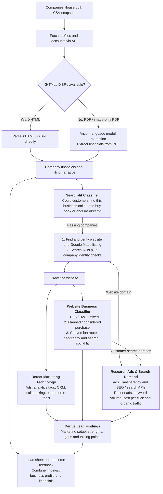
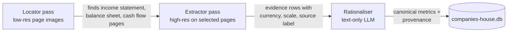

# Companies House Leads

A research system for identifying UK businesses that may be useful
PPC (pay-per-click advertising) prospects. It combines Companies House
records with website discovery, business classification, marketing-technology
detection and advertising research to build an evidence-based picture of
each company.

The aim is to explain why a business is worth reviewing: what it sells, who
its customers are, how they can convert, whether there is search demand and
what its current marketing setup appears to offer or lack. The result is a
lead sheet with financial context, supporting evidence and talking points,
plus outcome tracking to learn which prospects prove useful.

## End-to-end system diagram

```mermaid
flowchart TD
    A["Companies House bulk CSV snapshot"] --> B["Fetch profiles and accounts via API"]
    B --> D{"XHTML / iXBRL available?"}
    D -->|Yes: XHTML| X["Parse XHTML / iXBRL directly<br/>"]
    D -->|No: PDF / image-only PDF| V["Vision-language model extraction<br/>Extract financials from PDF<br/>"]
    X --> E["Company financials and filing narrative"]
    V --> E

    E --> S["`**Search-fit Classifier**<br/>Could customers find this business online and buy,<br/> book or enquire directly?`"]
    S -->|Passing companies| I["1. Find and verify website and Google Maps listing<br/>2. Search APIs plus company identity checks"]

    I --> C["Crawl the website"]
    C --> T["`**Detect Marketing Technology**<br/>Ads, analytics tags, CRM, call tracking, ecommerce tools`"]
    C --> W["`**Website Business Classifier**<br/>1. B2B / B2C / mixed<br/> 2. Planned / considered purchase<br/>3. Conversion route, geography and search / social fit`"]

    I -->|Website domain| M["`**Research Ads & Search Demand**<br/>Ads Transparency and SEO / search APIs<br/>Recent ads, keyword volume, cost per click and organic traffic`"]
    W -->|Customer search phrases| M

    T --> F["`**Derive Lead Findings**<br/>Marketing setup, strengths, gaps and talking points`"]
    W --> F
    M --> F
    E --> L
    F --> L["Lead sheet and outcome feedback<br/>Combine findings, business profile and financials"]
```

This diagram shows the lead funnel; intermediate evidence and results are
stored in SQLite. Accounts are parsed directly when XHTML/iXBRL is available;
PDF-only filings use separate vision pipelines for financial extraction and
filing transcription. The filing-based business classifier is a separate
analysis path rather than a prerequisite for the search screen.

Passing the screen means a company is a plausible search prospect. Website
classification, detected technology and advertising research add the evidence
for assessing PPC fit and preparing talking points. Purchase urgency and
conversion route are separate classifications: an emergency or planned
purchase can convert through a call, enquiry, booking or online sale. Detected
ad tags alone do not establish that a company is currently advertising.

See [the search-screen definition](docs/SEARCH_SCREEN.md) and
[the web-stage plan and results](docs/WEB_STAGE_PLAN.md) for the detailed
workflow and validation status. The local data is also available through
read-only MCP query tools.

## Why some companies disclose fuller financials

UK limited companies generally prepare annual accounts for shareholders and
file accounts at Companies House. Preparation and public disclosure are
separate obligations. Eligible small companies and micro-entities can
currently omit the profit-and-loss account from their public filing.
Medium-sized companies must file it, with some detail reductions; large
companies must file full accounts. See the
[Companies House accounts guidance](https://www.gov.uk/government/publications/filing-your-companies-house-accounts/life-of-a-company-part-1-accounts).

Company size depends on **turnover (sales revenue), total assets and average
employees**, rather than profit. For financial years starting **on or after
6 April 2025**, the limits are:

| Size regime | Annual turnover, at most | Balance sheet total (total assets), at most | Average employees, at most |
|---|---|---|---|
| Micro-entity | £1 million | £500,000 | 10 |
| Small | £15 million | £7.5 million | 50 |
| Medium-sized | £54 million | £27 million | 250 |

A company must satisfy **at least two of the three limits** to qualify for a
regime. Exceeding two small-company limits takes it beyond small; exceeding
two medium-company limits makes it large, subject to the rules below. Crossing
one limit alone is insufficient: £20 million turnover with £4 million assets
and 30 employees can still satisfy the small-company size test. The
[government's threshold impact assessment](https://www.legislation.gov.uk/ukia/2024/220/pdfs/ukia_20240220_en.pdf)
sets out these limits and the two-out-of-three test.

Size changes generally need **two consecutive financial years**; the first
financial year is assessed on its own. Public companies, certain financial
businesses and some group structures cannot use these concessions even when
their individual figures are below the limits. Audit exemptions have separate
conditions: filing full accounts does not by itself establish that they were
audited. See the
[qualification and exemption rules](https://www.gov.uk/government/publications/filing-your-companies-house-accounts/life-of-a-company-part-1-accounts#small-company).

For historical filings, financial years starting between **1 January 2016
and 5 April 2025** used lower small-company limits of **£10.2 million turnover
and £5.1 million assets**, and medium-company limits of **£36 million and
£18 million**; employee limits were unchanged. The applicable date is the
financial year's start, rather than when the accounts were uploaded. See the
[historical thresholds](https://www.gov.uk/government/publications/filing-your-companies-house-accounts/life-of-a-company-part-1-accounts#qualifying-as-a-medium-sized-company).

For this project, fuller filings offer more financial evidence, but a full
filing is not proof of a large business: smaller companies can disclose more
voluntarily. A missing turnover or profit figure may reflect permitted
non-disclosure, so it should remain missing rather than becoming zero.

**Rules checked 7 October 2026.** Companies House has announced changes from
**1 April 2028** requiring small companies and micro-entities to file
profit-and-loss accounts, with an option to keep them off the public register.
That change does not guarantee public access to their revenue and profits.
See the [accounts reform announcement](https://www.gov.uk/government/news/companies-house-to-bring-in-changes-to-accounts-filing-from-april-2028).

## No-XHTML PDF financial extraction (VLM pipeline)

```mermaid
flowchart LR
    P1[Locator pass<br/>low-res page images] -->|finds income statement,<br/>balance sheet, cash flow pages| P2[Extractor pass<br/>high-res on selected pages]
    P2 -->|evidence rows with<br/>currency, scale, source label| P3[Rationaliser<br/>text-only LLM]
    P3 -->|canonical metrics +<br/>provenance| G[(companies-house.db)]
```

This is implemented in `scripts/vlm/companies_house_pdf_vlm_financials.py`.
It never runs local OCR — Tesseract/RapidOCR were tried early on and retired.
The model transport is swappable: OpenRouter and a private Ollama GPU tunnel
use the identical three-stage process, so quality/speed/cost comparisons are
apples-to-apples.

The full behavioural reference — evidence tiers, insurance-account handling,
the retry and page-recovery ladder, row validation and employee evidence —
is in [scripts/vlm/README.md](scripts/vlm/README.md). A 50-PDF manually
verified comparison lives in
[evals/vlm_financials/README.md](evals/vlm_financials/README.md).

## Repository layout

The code is organised around the stages of the funnel. Evaluation cases live
separately from the pipelines, and downloaded documents and generated results
stay in local working folders.

| Folder | Role in the project |
|---|---|
| [core/](core/) | Shared Companies House extraction, filing-text parsing, entity-triage rules and SQLite persistence. |
| [scripts/ingestion/](scripts/ingestion/) | Reduces the national bulk snapshot to a candidate pool using company status, sector, age and filing information. |
| [scripts/enrichment/](scripts/enrichment/) | Fetches company profiles and accounts, fills in filed narrative and extends financial history. |
| [scripts/analysis/](scripts/analysis/) | Derives company-level signals, including trading, holding and dormant status, duplicate businesses and passthrough vehicles. |
| [scripts/vlm/](scripts/vlm/) | Vision-based PDF financial extraction and whole-document transcription, with evaluation and review tools. |
| [scripts/profile/](scripts/profile/) | The filing-based business classifier: what the company does, whom it serves, how it delivers and what its accounts say about customer acquisition. |
| [scripts/screen/](scripts/screen/) | The first search-fit screen, including model policies, evaluation, evidence packs and human-review workflows. |
| [scripts/web/](scripts/web/) | Website and Maps discovery, identity checks, crawling, technology detection, website classification, advertising research, lead findings and outcome tracking. |
| [scripts/eval_support/](scripts/eval_support/) | Shared experiment tracing, scoring, prompt management and annotation support for Langfuse. |
| [companies_house_mcp/](companies_house_mcp/) | A read-only Model Context Protocol interface for querying stored company, filing, financial and narrative data through an assistant. |
| [evals/vlm_financials/](evals/vlm_financials/) | Financial-extraction reference cases, reviewed labels and model configurations. |
| [evals/vlm_transcription/](evals/vlm_transcription/) | Model configurations for transcription comparisons. There is no human-labelled transcription gold set; a second model's reading provides a cross-check. |
| [evals/business_profiles/](evals/business_profiles/) | Reference cases and configurations for the filing-based business classifier. |
| [evals/search_screen/](evals/search_screen/) | The search-screen reference cases, selection record and blind evaluation subset. |
| [evals/web_identity/](evals/web_identity/) | A seeded sample of companies with reference website labels, including a blind subset for checking identity resolution. |
| [evals/web_profile/](evals/web_profile/) | Website-classification cases, draft labels, reference search phrases and records linking cases to human-review queues. |
| [sql/](sql/) | Exploration queries for financial history, company triage and combined website, advertising and lead evidence. |
| [tests/](tests/) | Automated checks for extraction, persistence, classifier validation, web research and query behaviour. |
| [docs/](docs/) | Design explanations, stage definitions, acceptance criteria, schema references and experiment findings. |
| `data/raw/` | Local source material: bulk snapshots, filings and cached search-provider responses. |
| `data/processed/` | Derived candidate lists and other processed data. |
| `logs/` | Local run reports, checkpoints, saved responses and provider-usage records. |
| `vlm-noxhtml-pdfs/` | Local PDF filings used by the vision pipeline. |

The working data, PDFs, logs and `companies-house.db` are gitignored.
The repository holds the code, definitions and evaluation cases rather than
a downloadable copy of the enriched company population.

## How leads are assessed

The project asks three related questions: **is this a plausible prospect,
does search suit its business, and is there a useful marketing opportunity?**
Each stage contributes evidence to those questions.

Companies House provides the starting point: a stable company identifier,
filed financials and the business's own description of its activities. Entity
triage helps distinguish a trading business from a holding company, dormant
entity or financing vehicle, and flags duplicate representations of the same
business. Financials provide context about size and performance; they do not
establish a marketing budget or willingness to buy.

The search screen then asks whether a customer could plausibly search for
this kind of business and buy, book or enquire directly. It deliberately keeps
both likely and possible prospects so that uncertain filings do not
prematurely remove useful companies. Passing is an invitation to investigate
the web evidence, rather than a final PPC recommendation.

The separate filing-based business classifier captures a richer description
of the business. It remains an analysis tool alongside the funnel; its
customer-acquisition labels are not a prerequisite for passing the screen.

## What the web stage adds

A registered company name is often different from the brand its customers
know. Website discovery therefore combines search results, Google Maps
listings and trading names with checks against company numbers, names,
addresses and the site's own legal information. It records the strength of
the match, including ambiguous matches and cases where no website is found.

Once a site is identified, a crawl supplies two kinds of evidence. Technology
detection looks for advertising and analytics tags, CRM and call-tracking
tools, booking systems and ecommerce features. A text-based model reads the
site to classify the business and the customer journey:

| Classification | What it helps explain |
|---|---|
| Business description and category | What the company actually sells, using its Maps category where available or a model-assigned category otherwise. |
| Customer type | Whether the main customers are businesses, consumers or a mix of both. |
| Purchase urgency | Whether customers need help in an emergency, plan ahead or make a considered purchase. |
| Conversion route | Whether the site mainly invites an online purchase, booking, call, enquiry form or visit. |
| Geography | Whether it serves a local, regional, national or international market. |
| Typical sale value | The approximate value band of a purchase. |
| Channel fit | Whether search, social advertising or both appear suited to the offer. |
| Tender dependence | Whether public procurement or contracted programmes are a substantial source of work. |

The website profile also proposes unbranded phrases a customer might search
for. Search and SEO APIs add keyword volume, cost per click and estimates of
organic traffic. Ads Transparency supplies evidence of recent advertising;
an optional live search adds a snapshot of search visibility.

These sources answer different questions. A Google Ads tag shows a piece of
the site's setup, while a recently observed ad shows advertising activity.
Keyword demand indicates the size of a potential search market; it is not
the company's actual ad spend.

## From evidence to a lead

The findings stage combines advertising activity, search demand and detected
technology into specific strengths, gaps and talking points. For example, a
business may have search demand but little recent advertising evidence, or
it may be running ads while the crawl finds no conversion-tracking event.
Existing measurement tools and an established setup can also count as
strengths.

These are observations to review in a commercial conversation. A crawl
cannot see every part of a company's marketing operation, and a tool that
was not detected may still exist. The findings retain their supporting
evidence so that a reviewer can judge the claim.

The lead sheet brings the business profile, financial context, website and
Maps links, advertising evidence and findings together in one row per
company. Its current order follows explicit sorting rules. A ranking proven
to predict sales outcomes is a separate goal.

Outcome tracking records whether a lead was contacted, replied, led to a
meeting or was won. That feedback is intended to test which signals predict
useful prospects and improve future prioritisation.

## Evaluation and confidence

The extraction and classification stages have separate reference cases
because they solve different problems. Financial extraction is checked
against figures in the filing; screening and business classifications need
reviewed judgements; website resolution is checked against the company's
actual customer-facing site.

Model-drafted labels are proposals until reviewed. Blind subsets help test
whether changes generalise beyond the examples used to develop them.
Transcription comparisons between two models are useful cross-checks, but
agreement between models does not replace a human-labelled reference.

One shared Langfuse instance records experiments and review queues, with a
trace for each evaluated case so that the prompt, response, evidence and score
can be inspected together. Local checkpoints preserve completed work and
allow saved responses to be rescored when validation or scoring rules change.

The system keeps source evidence and derived judgements distinguishable.
Missing filings, unreadable pages, ambiguous website matches, blocked crawls
and unclear classifications remain visible rather than becoming confident
answers. Annual accounts can also lag the business's current situation, so
filed evidence and current website evidence may legitimately differ.

The detailed definitions and validation results live in
[the search-screen reference](docs/SEARCH_SCREEN.md),
[the business-profile design](docs/BUSINESS_PROFILE_EXTRACTION.md),
[the web-stage plan and results](docs/WEB_STAGE_PLAN.md) and
[the financial-extraction reference](scripts/vlm/README.md).

## Experiment reviews

[The experiment reviews](docs/experiments/README.md) explain what was tested,
the results, what changed as a result and what remains uncertain. They cover
financial extraction, filing-based classification, search screening, website
discovery, technology detection and advertising research, with a separate
summary of the lessons and decisions across stages.
