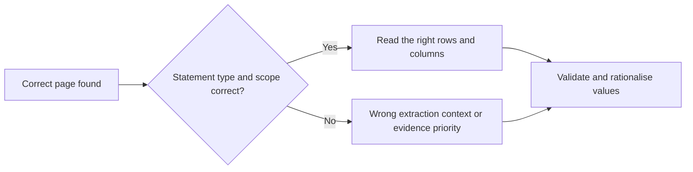

# PDF financial extraction: experiment review

[Experiment overview](README.md) | Evidence reviewed through 2026-10-05

## Question

Can PDF-only Companies House accounts be converted into reliable financial
metrics, including values from complex statements and employee notes, at a
reasonable cost?

The pipeline uses a vision model to locate relevant pages, reads selected
pages at higher resolution, and rationalises the evidence into standard
metrics. The experiments tested both the final values and the intermediate
decisions that determine which figures reach the final stage.

## Experiments and results

The main benchmark contains 50 reviewed PDFs, with development and holdout
splits. The August runs used `qwen/qwen3-vl-235b-a22b-instruct` for location,
extraction and rationalisation, with `google/gemini-2.5-flash` as the recovery
vision model in the later run configurations.

The table reports **correct values where the reference expects a value**.
Core financial values and employee counts are separate because their failure
modes differ. It does not count correctly empty cells as successes.

| Experiment | Date | Core financial values | Employee values | Recorded cost, USD |
|---|---|---|---|---|
| Reviewed baseline | 2026-08-15 | 551/572, 96.33% | 73/85, 85.88% | $2.138 |
| Statement-type and recovery changes | 2026-08-17 | 559/572, 97.73% | 71/85, 83.53% | $1.679 |
| 768-pixel locator run | 2026-08-18 | 556/572, 97.20% | 77/85, 90.59% | $2.035 |
| Currency, operating-result and dash handling run | 2026-08-18 | 568/572, 99.30% | 79/85, 92.94% | $1.334 |
| Subsequent profit-before-tax fix run | 2026-08-18 | 568/572, 99.30% | 77/85, 90.59% | $1.327 |

Sources: [baseline report](../../logs/comparison-50-20260815/summary.json)
and the saved cell reports for the
[statement-type run](../../logs/vlm-eval-50-statement-type-fix/current-labels-cell-report/current-labels-cell-summary.json),
[locator run](../../logs/vlm-eval-50-locator768/current-labels-cell-report/current-labels-cell-summary.json),
[currency/dash run](../../logs/vlm-eval-50-currency-opresult-dash/current-labels-cell-report/current-labels-cell-summary.json)
and [profit-before-tax run](../../logs/vlm-eval-50-pbt-fix/current-labels-cell-report/current-labels-cell-summary.json).

The baseline recorded $2.138 across 50 documents, approximately $0.0428 per
document. The later cost totals sum the 50 per-document `cost.usd` records
in each run's `summary.json`, alongside the linked cell report. These are
historical recorded costs, not current price quotes. The later reports mix
provider-reported and token-estimated amounts; this is not a reconciled
billing comparison or an isolated measurement of resolution's cost effect.

The best core result exceeded the original 99% target on this benchmark.
However, the currency/dash run's all-metric exact-document rate was only
22%, or 11/50 documents. A document can contain many correct financial cells
and still fail because of one employee or other metric error.
See [the run aggregate](../../logs/vlm-eval-50-currency-opresult-dash/summary.json).

## What we learned

**Page discovery and page classification are different problems.** The first
diagnosis concluded that the locator was not the bottleneck because the
correct source pages were present. Later inspection found that statement-type
and group/company-scope labels controlled how the downstream reader used
those pages. A balance sheet found but labelled as an income statement could
still lose its values.

**A rule can fix one filing and damage another.** The documented cash
tie-break fixed one insurance case but regressed another when scope labels
were wrong. A plausible accounting preference needs checks against the
actual candidates and statement structure.

**Resolution alone did not produce a general improvement.** The 768-pixel
run improved employee values relative to the August 17 run but reduced core
financial accuracy. Later policy and handling changes produced the stronger
core result. The sequence does not isolate the causal contribution of every
individual change.

**Employees need their own evidence strategy.** Employee counts may occur
in notes or as narrative statements of zero, outside the primary financial
pages. In the currency/dash run, narrative-zero recall was 4/8 despite the
strong core-financial result. Blending those scores would hide the weakness.

## Decisions and current position

Retain the staged pipeline, source evidence and separate metric groups.
Inspect statement type, scope, row selection and validation when diagnosing
a failure, rather than assuming the model could not read the number.

Treat 99.30% as a result from specific saved runs on 50 PDFs. It is not a
guarantee for all filing types, models or future batches. The later
profit-before-tax run preserved core accuracy while employee accuracy fell,
so it is not an unqualified improvement across the task.

Whole-document PDF transcription is a separate capability for supplying
filing text to classifiers. It has no human-labelled transcription gold
set; two-model agreement is a cross-check rather than a benchmark accuracy
claim. See [the transcription reference](../../scripts/pdf_vision_extraction/README.md#whole-document-transcription-image-only-filings).

## Limits and next evidence

The later cell reports use the same 572 expected core values and 85 expected
employee values, but their summaries do not establish an identical immutable
label snapshot. Run names also describe packages of changes, not necessarily
controlled single-variable experiments. Read these as historical comparisons,
not precise estimates of each change's effect.

The original error analysis found that failures were concentrated in a few
documents. A small number of corrected cells can move the headline score,
and tuning on those filings risks overfitting. Development and holdout
performance, repeated runs and fresh difficult cases are needed before
making a broader reliability claim.

## Evidence

- [Original benchmark analysis and revised diagnosis](../BENCHMARK_IMPROVEMENT_PLAN.md).
- [Pipeline behaviour, evidence tiers and recovery](../../scripts/pdf_vision_extraction/README.md).
- [Evaluation definitions and reviewed cases](../../evals/vlm_financials_gold_set/README.md).
- [Baseline label snapshot](../../logs/comparison-50-20260815/gold-label-snapshot.csv).

The saved reports are local evidence; see the [overview's source policy](README.md#sources-and-maintenance).
