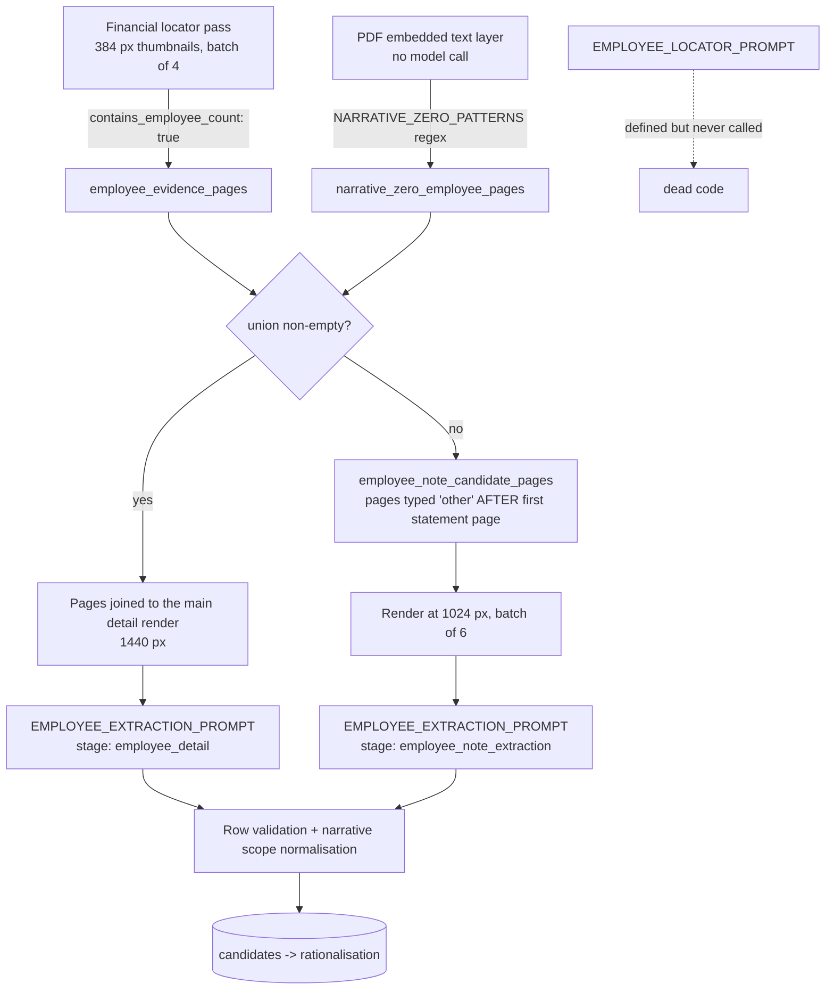

# Employee count discovery and extraction

Employee counts are extracted by the same pipeline as the financial metrics but
follow a different path, because they behave differently: a count sits in an
arbitrary note rather than on one of three known primary statements, and the
evidence may be a table figure, a dash, or a sentence of prose.

This documents how it currently works, including two defects found while
analysing the 2026-08-17 benchmark. For the financial path see
[README.md](README.md); for evaluation see
[../../evals/vlm_financials/README.md](../../evals/vlm_financials/README.md).

## Discovery: three routes, one of them dead



There is **no dedicated employee locator pass**. `EMPLOYEE_LOCATOR_PROMPT` is
defined but never referenced, and `employee_locator_calls` is initialised empty
and never appended to — which is why the cost report shows
`employee_locator: $0.00`. Discovery rests entirely on the financial locator's
`contains_employee_count` flag plus the deterministic text backstop.

That matters because the financial locator runs on **384 px thumbnails**. At
that size an A4 page is roughly 384x272, and a line such as
`The average number of employees was 12` is a few pixels tall.

## Resolution by stage

| Stage | Long edge | Batch | Configurable |
|---|---|---|---|
| Financial locator (also flags employee pages) | **384 px** | 4 | no — hardcoded |
| Main detail extraction (flagged employee pages join this) | 1440 px | 2 | no |
| Targeted employee note fallback | 1024 px | 6 | no |
| Recovery re-reads | 2048 px (min 1440) | 1 | yes |

## The text backstop

`narrative_zero_employee_pages()` scans the PDF's embedded text layer with no
model call, so it is effectively free. It fires only on unambiguous phrasing:

| Accepted | Rejected |
|---|---|
| `has / had / have no employees` | `no employees other than directors` |
| `employed no employees / persons` | `no employees ... except (for) ...` |
| `did not employ (any) employees / persons` | staff-cost amounts |
| `does not (directly) employ (any) staff / employees / persons` | director counts |
| `(average) number of staff/employees/persons ... was/were nil` | |

The rejection pattern (`AMBIGUOUS_NARRATIVE_ZERO_PATTERN`) is applied to the
whole page, so one qualified sentence suppresses the page even if an
unambiguous statement also appears on it.

This backstop only works on PDFs with a text layer. Much of this corpus is
scanned, where it returns nothing and discovery falls back to the 384 px pass.

## Evidence kinds

| `evidence_kind` | Accepted form | Stored |
|---|---|---|
| `numeric` | A count in an employee table | displayed value + normalised count |
| `dash_zero` | An unambiguous dash in an employee-count table | count 0 |
| `narrative_zero` | An explicit sentence such as `The Company has no employees` | count 0, sentence kept verbatim in `evidence_text`, display left null |

A narrative zero carries an explicit `period_scope` of `current`, `previous` or
`both`. It is never copied into the comparative period unless the wording names
that period — `NARRATIVE_BOTH_PERIODS_PATTERN` governs this. An unqualified
present-tense sentence counts as current-period evidence only.

## Measured performance (2026-08-17, 50 cases)

85 expected values, 71 correct — **83.5%**, 16 errors across 10 documents, of
which 14 are missing predictions and 2 are false positives. Attributing each
error to the stage that caused it:

| Cause | Errors | Detail |
|---|---|---|
| Extraction failed on a correctly found page | 7 | Page flagged by the locator, sent to employee extraction at 1440 px, count still not produced (11972771 p16, 14208267 p22, 14476358 p19, 14550816 p19) |
| Discovery failed | 7 | Locator did not flag the page and the fallback did not reach it (13941271 p26, 13984706 p19, 14297877 p5, 14328191 p4, 14523269 p27) |
| False positive | 2 | Count produced where the gold label says none (14550848) |

So it splits roughly evenly between *not finding the page* and *finding the
page but not reading the count off it*. Raising locator resolution addresses
only the first half.

## Known defects

**1. The fallback cannot reach pages before the first statement.**

```python
first_statement_page = min(statement_pages_found)
... if first_statement_page < page <= page_count and item["statement_type"] == "other"
```

`employee_note_candidate_pages()` only considers pages *after* the first
primary statement. Two failures have gold evidence at pages 4 and 5 —
in the Directors' or Strategic Report, where "the company has no employees"
commonly appears. The fallback structurally cannot reach them, and on a
scanned filing the text backstop cannot either.

**2. The fallback only runs when discovery found nothing at all.**

The guard is `if not employee_pages:`. If the locator flags one page anywhere
in the document, the targeted note pass never runs — even when the flagged page
turns out to hold no usable count. A partially-correct discovery therefore
suppresses the recovery path entirely.

**3. `EMPLOYEE_LOCATOR_PROMPT` is dead code.** Either wire it in as a real
second pass or delete it; leaving it implies a pass that does not exist.
