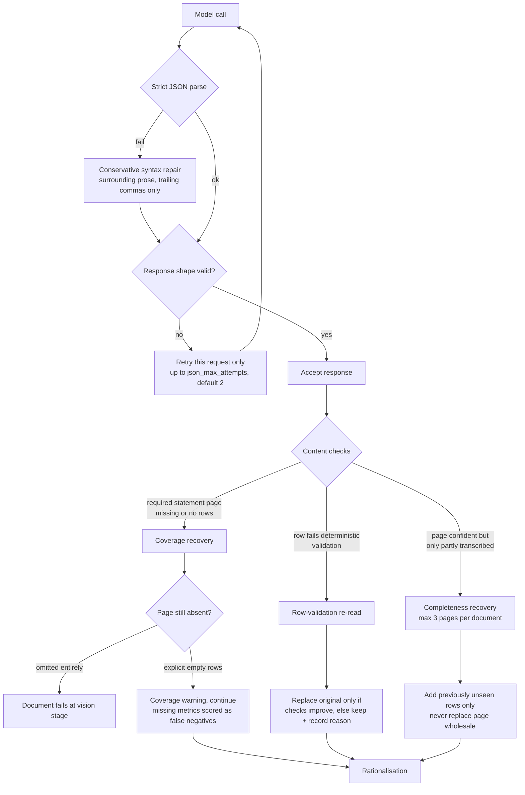

# VLM financial extraction

Extracts financial statements from Companies House PDF filings that have no
XHTML/iXBRL version. No local OCR runs anywhere in this pipeline: a vision
model reads rendered page images, and a text-only model then selects canonical
metrics from the transcribed evidence.

This document describes **what the pipeline does and why**. For how to run
evaluations against it, see [evals/vlm_financials/README.md](../../evals/vlm_financials/README.md).

## Model stages

These are the stage names as they appear in logs and MLflow trace spans:

| Stage | Resolution | What it does |
|---|---|---|
| `locator` | low | One pass over the whole document. Classifies income statement / balance sheet / cash-flow pages, and labels direct employee-count evidence. |
| `vision` | high | Transcribes rows from the selected statement pages only. |
| `employee_note_extraction` | medium | Targeted fallback over `other` note pages when the locator and the text backstop both found no employee evidence. |
| `vision_recovery` | high (or `recovery_render_long_edge`, default `2048`) | Focused single-page re-reads. Three distinct triggers — see below. |
| `rationalisation` | text-only | Picks canonical metrics from evidence-backed candidates. Receives only canonical output candidates. |

The model transport is swappable: OpenRouter and a private Ollama GPU use the
identical process, so quality, speed and cost comparisons are like-for-like.

## Reliability and recovery

There are two independent layers. Layer 1 is about whether a response is
*well-formed*; layer 2 is about whether the *content* is complete. All three
layer-2 mechanisms log under the single stage name `vision_recovery`, which is
why they are easy to confuse when reading traces.

### Layer 1 — JSON transport

Applies to every model call at every stage. OpenRouter configurations can
request JSON mode; Ollama uses its native JSON format. The runner then:

1. parses the response as strict JSON;
2. applies only conservative syntax repair (surrounding prose or trailing
   structural commas), without filling missing values or completing strings;
3. validates the locator, extraction or rationalisation response shape;
4. retries only that failed request up to `json_max_attempts` (two by default);
5. records every raw response, repair method, validation error, timing, usage,
   cost and provider identifier.

Failure reasons recorded include `invalid_json`, `invalid_schema` and
`missing_statement_page_response`. The attempts appear in each MLflow stage
span under `response_reliability`.

### Layer 2 — page recovery

| Trigger | Fires when | Consequence |
|---|---|---|
| **Coverage recovery** | A page the locator classified *directly* as a statement returns no rows, or is missing from the response. | One focused single-page request. If the page is still omitted entirely, the document fails at the vision stage. If it comes back with an explicitly empty `rows` list, a coverage warning is recorded and the run continues on other evidence. |
| **Row-validation re-read** | A transcribed row fails a deterministic check (see [Row validation](#row-validation)). | One focused re-extraction of the same rendered page. The recovered response replaces the original **only if it improves those checks**; otherwise the rejected candidate and its reason stay in the trace and cannot reach rationalisation. |
| **Completeness recovery** | A confidently-read primary statement page looks partially transcribed — e.g. a balance sheet with no net-assets/shareholders'-funds row, or with a visible `Current assets` row but no cash row. | One further high-resolution read, bounded to three pages per document. Re-reads the whole table but adds **only previously unseen rows**. If two readings disagree on the same row, the original is kept and the conflict recorded for diagnosis. |

Set `recovery_vision_model` in the configuration to run recovery on a
different vision model from normal extraction. Only the failed page is
re-rendered; primary extraction stays on the primary model.

The extractor distinguishes pages the locator classified *directly* as a
statement from neighbouring pages pulled in only for visual context. Only
direct statement pages must return at least one row. The extraction trace
records required, returned, recovered, empty and missing pages under
`statement_page_coverage`.

## Evidence tiers and candidate ranking

Every candidate row is annotated with a deterministic `source_role` and a
numeric `evidence_tier` **before** anything model-reported is considered.
Lower tier wins.

| Tier | `source_role` | Meaning |
|---|---|---|
| 1 | `primary_statement` | Exact canonical row on its matching primary statement. |
| 2 | `primary_insurance_income_statement` | Compatible native insurance row on an income statement. |
| 3 | `direct_primary_synonym` | `Shareholders' funds` / `Total equity` on a balance sheet, or profit-before-tax on an income statement. |
| 4 | `exact_supporting_note` / `exact_insurance_note` | Exact fallback found on a note page. |
| 5 | `incompatible_*`, `unclassified` | Ineligible. Never reaches rationalisation. |

Candidates are then ranked in this order — note that model self-reported
confidence is the **last** tiebreaker, not the first signal:

1. `evidence_tier` (lower is stronger)
2. unit is known (not `UNKNOWN`)
3. number of periods the row actually supplies a value for
4. model `confidence`

Additional deterministic rules:

- A canonical row must match its statement family before filing scope is
  considered: turnover/profit belong to an income statement, cash to a balance
  sheet or cash-flow statement, net assets to a balance sheet.
- An operating result needs a *total* label (`Operating profit`, `Operating
  loss`, `Profit from operations`). Components such as `Net operating
  expenses` and exchange movements are rejected as diagnostic evidence.
- Aggregate rows are never proxied for another metric — `Current assets` is
  never cash.
- A combined `Total liabilities and shareholders' funds` total is not a
  net-assets candidate.
- Direct Group evidence is preferred, but a Company income-statement candidate
  outranks a Group cash-flow or other fallback for the same canonical metric.
- Standalone shareholders'-funds and total-equity rows are valid net-assets
  equivalents in both Group and Company balance sheets. Scope is preserved, so
  direct consolidated Group equity excludes a competing standalone Company row.
- A candidate derived from `Shareholders' funds` or `Total equity` keeps its
  original label and row ID as provenance but can only be selected through its
  canonical `net_assets` ID.
- When the rationaliser picks a row for one period and leaves the other null,
  deterministic completion may reuse that row **only** when it visibly contains
  a valid counterpart value. Recorded in
  `rationalisation_policy.paired_period_completions`; it never picks a new row
  or invents a value.

## Insurance accounts

Insurance filings present a technical account rather than a conventional
income statement, so eleven native insurance metrics are recognised
(`gross_premiums_written`, `net_earned_premiums`, `technical_account_result`
and so on) and mapped to canonical metrics.

The important constraint: an insurance row must carry a **compatible visible
label**. Generic note labels such as `Total` or `Reinsurance inwards` cannot be
promoted into earned premiums, claims incurred or a technical-account result.
For insurance accounts a visible technical account result outranks profit
before tax (tier 2 vs tier 3); profit before tax remains the fallback.

The exact accepted label families live in `_INSURANCE_LABEL_PREFIXES` in
[financial_metric_policy.py](financial_metric_policy.py) and are matched by
prefix, so a qualifier like `Balance on the technical account for general
business` is accepted while a bare `Total` is not. They are deliberately not
duplicated here — read them from the code.

## Row validation

After primary-statement extraction, deterministic checks reject evidence:

| Check | Rejects |
|---|---|
| Missing source label or value | Rows with no usable label or no value. |
| Unknown money unit | Rows whose unit could not be established. |
| Year used as a value | A date/year heading transcribed into a value cell. |
| Metric/label conflict | e.g. `cash` sourced from a `Current assets` row. |

A failed check triggers the row-validation re-read described above.

These checks deliberately do **not** attempt to verify individual digits from
pixels. A clean-looking but wrong transcription stays a model/evaluation
problem rather than causing every page to be retried.

When a money row shows both current and comparative column headings but only
one cell was transcribed, the row remains usable for the period it does have
and triggers the same focused recovery. A comparative dash becomes zero only
if the extraction or recovery **explicitly returns that dash** — a missing cell
is never inferred as zero.

## Employee evidence

The locator labels direct employee-count evidence. If that and the
embedded-text narrative-zero backstop both find nothing, the pipeline makes
one targeted medium-resolution pass over `other` pages in the notes section
after the first primary statement. There is no second document-wide employee
locator pass, which keeps the fallback bounded to likely note pages.

| `evidence_kind` | Accepted form |
|---|---|
| `numeric` | A numeric count in an employee table. |
| `dash_zero` | An unambiguous dash in an employee-count table. |
| `narrative_zero` | An explicit statement such as `The Company has no employees`. |

Narrative zeroes retain the quoted evidence, a normalised count of zero, and an
explicit current/previous/both scope. A narrative zero is **never** copied into
the comparative period unless the document says it applies to both.

Explicitly rejected as employee-count evidence: staff-cost disclosures, and
qualified statements such as `no employees other than directors` (recorded as
`ambiguous_narrative_zero_evidence`).

## What SIC is used for

A run may pass the company's stored SIC registration to the rationaliser as
advisory context, and record it in the MLflow trace. SIC **never** enables a
mapping or overrides the visible statement type, source label, unit, scope or
evidence tier.

This is intentional: a registered SIC may be broad, stale, or simply disagree
with the accounting presentation actually used in the PDF.

## Failure behaviour

If all attempts fail, the PDF result carries `status: error` and an
`error_stage`, while retaining the outputs and charge already incurred from
earlier successful stages.

## Related

- [evals/vlm_financials/README.md](../../evals/vlm_financials/README.md) — creating gold-label cases, running and scoring evaluations.
- [financial_metric_policy.py](financial_metric_policy.py) — source of truth for canonical/insurance mappings and tier assignment.
- [../../README.md](../../README.md) — how this pipeline fits into the wider lead pipeline.
